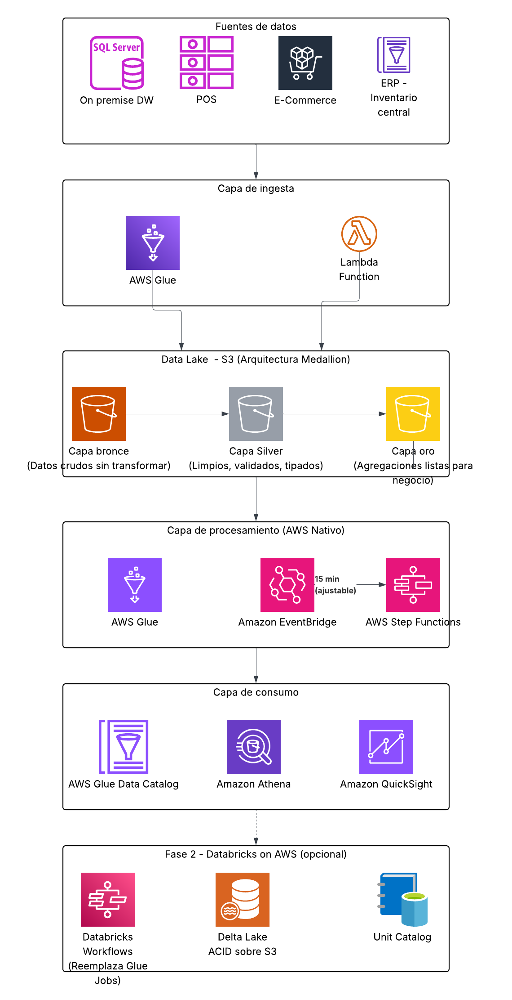

# Entregable 2: Diagrama de Arquitectura en AWS

> Propuesta de arquitectura cloud para RetailMex. Cada componente incluye
> justificación explícita y trade-offs considerados.

---



---

## Justificación por Capa

### Capa 1 — Ingesta: Glue JDBC + Lambda

**AWS Glue (JDBC)**
- Conecta directamente al SQL Server on-premise sin instalar agentes adicionales.
- El driver JDBC de Glue permite leer tablas incrementalmente usando marcas de tiempo (`updated_at`), evitando full-scans costosos.
- Serverless: no hay cluster que aprovisionar ni mantener, ideal para un equipo de 2 personas.

**AWS Lambda (webhook)**
- El e-commerce es la fuente de mayor crecimiento (40% mensual) y la más dinámica. Un webhook que dispare Lambda permite capturar eventos de venta en segundos, no en el próximo ciclo de batch.
- Lambda escala automáticamente ante picos de tráfico (campañas, temporadas altas) sin intervención manual.
- **Trade-off considerado**: Si el proveedor de e-commerce no soporta webhooks y/o API Rest y sólo ofrece acceso a BD, este componente se reemplaza por un segundo Glue Job JDBC.

**¿Por qué no Kinesis Data Streams o algún servicio de Data Streaming?**
El SLA de negocio es ≤ 15 minutos, no segundos. Kinesis agregaría complejidad operativa (shards, retención, consumers) y un costo mensual fijo innecesario para este volumen y latencia objetivo.

---

### Capa 2 — Data Lake S3: Arquitectura Medallion

| Zona | Contenido | Formato |
|---|---|---|
| `bronze/` | Datos tal como llegan de origen — sin modificar | JSON / CSV raw |
| `silver/` | Datos limpios, validados, tipados y deduplicados | Parquet particionado |
| `gold/` | Agregaciones de negocio listas para consumo | Parquet optimizado para Athena |

**¿Por qué Medallion?**
- **Reprocesamiento seguro**: si hay un bug en Silver, los datos originales en Bronze están intactos. Se puede volver a procesar sin tocar las fuentes.
- **Extensibilidad**: agregar una nueva fuente (e.g. MercadoLibre) sólo requiere un nuevo job de ingesta hacia Bronze — las capas Silver y Gold no necesitan rediseñarse.
- **Separación de responsabilidades**: cada capa tiene una sola razón de cambio.

**Particionamiento sugerido en Silver/Gold:**
```
s3://retailmex-datalake/silver/ventas/
  year=2025/month=04/day=13/hour=10/
```
Esto permite a Athena hacer partition pruning y reducir el costo de las consultas.

Es decir, si hacemos una consulta en Athena:
```
SELECT * FROM ventas WHERE fecha = '2025-04-13'
```

Accedería a una fecha en específico, si no particionamos, se vería algo así:
```
s3://retailmex-datalake/silver/ventas/
├── part-0001.parquet   ← contiene mezcla de todos los días
├── part-0002.parquet
├── part-0003.parquet
└── ... 500 archivos más
```
Buscaría dentro de todo el repositorio de S3. Mientras que al particionar, pasaría lo siguiente:

```
s3://retailmex-datalake/silver/ventas/
├── year=2025/
│   ├── month=03/
│   │   └── day=31/
│   │       └── part-0001.parquet
│   └── month=04/
│       ├── day=12/
│       │   └── part-0001.parquet
│       └── day=13/         ← Athena sabe que aquí están los datos
│           └── part-0001.parquet
```

Solo se leería 1 parquet y todo buscaría dentro de todos los archivos. Ahorrando costos de lectura y procesamiento.

**Posible diseño estrella en GOLD**

Si la estructura de datos lo permite y/o previamente existe un diseño similar con tablas relacionadas entre sí, es problable la implementación del diseño estrella en la capa Gold para dar una mejor orden a los datos.

---

### Capa 3 — Procesamiento: Glue Jobs + Step Functions

**AWS Glue Jobs (PySpark)**
- Lenguaje obligatorio en el stack. Glue ejecuta PySpark nativo con integración directa al Glue Data Catalog.
- Cada job corre de forma independiente y puede reejecutarse sin afectar los demás (**idempotencia**).
- ¿Por qué Glue Data Catalog? Porque sería el traductor de los esquemas de S3 para que Athena sepa qué es cada partición.

**AWS Step Functions**
- Orquesta el pipeline en secuencia: Bronze Job → Silver Job → Gold Job.
- Si el Bronze Job falla, el pipeline se detiene y no produce datos incorrectos en capas superiores.
- Ofrece visibilidad visual del estado de cada ejecución en la consola de AWS — crítico para un equipo pequeño sin tiempo para leer logs.
- **Trade-off considerado**: Airflow ofrece más flexibilidad para pipelines complejos, pero tiene un costo base de ~$400/mes independientemente del uso. Step Functions cobra por transición de estado, lo que lo hace más económico para ejecuciones cada 15 minutos.

**EventBridge Scheduler**
- Dispara el pipeline cada 15 minutos, cumpliendo exactamente el SLA de negocio.
- Si el negocio necesita cambiar la frecuencia (e.g. cada 5 minutos en horario pico), se modifica una sola regla sin tocar código.

---

### Capa 4 — Consumo: Athena + Glue Catalog + QuickSight

**Amazon Athena**
- Permite hacer consultas SQL directamente sobre los archivos Parquet en S3, sin necesidad de cargar datos en un DW separado.
- Costo por query (pay-per-scan) — para un equipo pequeño con consultas ocasionales es significativamente más económico que Redshift.

**Glue Data Catalog**
- Repositorio central de metadatos: esquemas, particiones, tipos de datos.
- Athena y cualquier herramienta de BI lo consulta automáticamente.

**Amazon QuickSight**
- BI serverless nativo de AWS, con conector directo a Athena.
- **Trade-off considerado**: Si el negocio ya tiene licencias de Tableau o Power BI, QuickSight puede omitirse — Athena funciona como fuente para cualquier herramienta que soporte JDBC/ODBC o conectores nativos.

---

### Fase 2 — Databricks en AWS (Opcional)

Esta fase reemplaza los Glue Jobs de procesamiento, manteniendo S3 como storage.

| Componente Glue (Fase 1) | Reemplazado por (Fase 2) | Beneficio |
|---|---|---|
| Múltiples Glue Jobs | Databricks Workflows | Orquestación y desarrollo unificados |
| Parquet en S3 | Delta Lake sobre S3 | ACID, time travel, schema enforcement |
| Glue Data Catalog | Unity Catalog | Linaje, gobernanza y control de acceso centralizado |

**¿Por qué no en Fase 1?**
- La curva de aprendizaje y el costo de onboarding de Databricks es mayor que Glue para un equipo de 2 personas partiendo de cero en AWS.
- Glue + S3 Parquet es completamente compatible con Delta Lake — la migración no requiere mover datos, sólo cambiar el motor de escritura.
- Esta decisión está alineada con el roadmap tecnológico comunicado por el equipo de datos. Además, va acorde con decisiones de negocio, y si para ellos es viable hacer dicha inversión. Es considerada como buena, si existe un supuesto crecimiento en el equipo de tecnología de datos.

---

## En resumen  — Servicios AWS 
| Servicio | Capa | Rol |
|---|---|---|
| S3 | Data Lake | Storage principal (Bronze / Silver / Gold) |
| AWS Glue | Ingesta + Procesamiento | JDBC connector + ETL jobs PySpark |
| AWS Lambda | Ingesta | Receptor de webhook/API REST e-commerce |
| Step Functions | Procesamiento | Orquestación del pipeline |
| EventBridge | Procesamiento | Scheduler cada 15 minutos |
| Athena | Consumo | SQL ad-hoc sobre S3 |
| Glue Data Catalog | Consumo | Metadatos y esquemas centralizados |
| QuickSight | Consumo | Dashboards de BI |
| IAM | Transversal | Roles con least-privilege por servicio |
| CloudWatch | Transversal | Logs, métricas y alertas operativas |
| VPN / Direct Connect | Red | Conexión segura al SQL Server on-premise |

---

